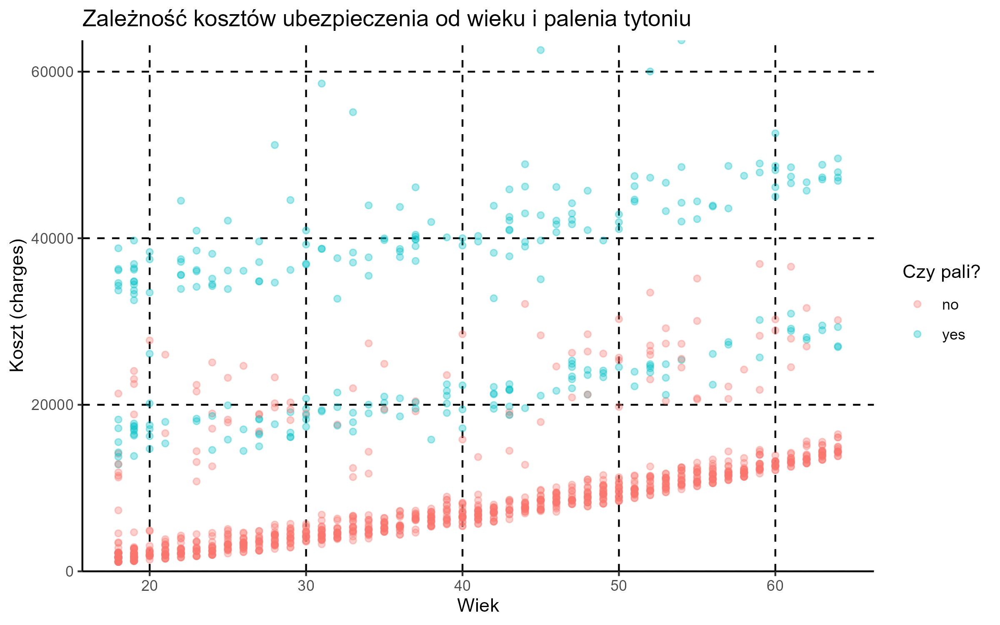
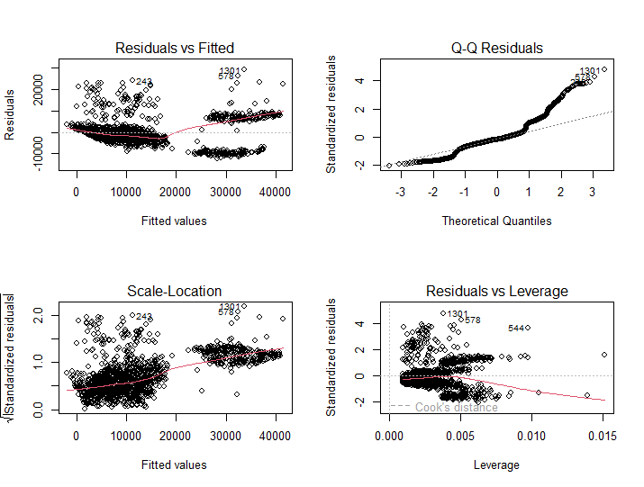
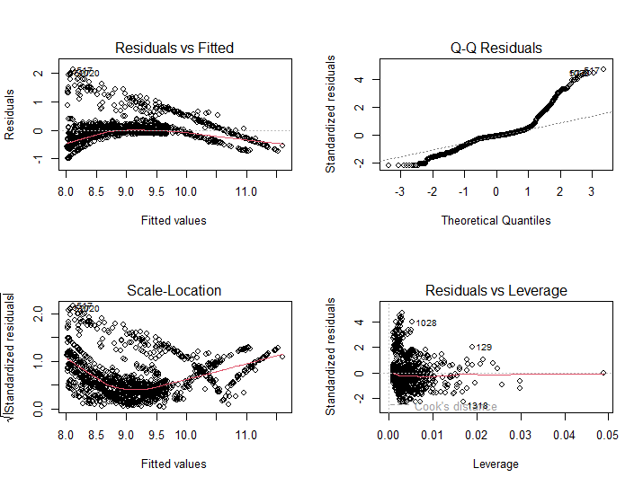

# Insurance-pricing-model

Projekt przedstawia pełną ścieżkę analityczną budowy silnika taryfikacyjnego na podstawie historycznych danych o szkodowości (Medical Cost Dataset z Kaggle). Celem jest wycena ryzyka i kalkulacja składek dla nowych klientów.

## Cel biznesowy
* Identyfikacja kluczowych czynników ryzyka wpływających na wysokość rocznych roszczeń.
* Przełożenie modelu statystycznego na gotowe narzędzie predykcyjne do wyceny polis.
* Weryfikacja założeń ekonometrycznych i optymalizacja taryfy.

## Technologie i narzędzia
* **Język:** R
* **Biblioteki:** `tidyverse` (`dplyr` do manipulacji danymi, `readr` do importu, `ggplot2` do wizualizacji)
* **Podejście:** Regresja Liniowa (MNK), Transformacje Log-Liniowe, Diagnostyka Gaussa-Markowa (BLUE)

## Główne wnioski z analizy
Wizualizacja szkodowości względem wieku wyraźnie wskazuje na istnienie dwóch odseparowanych segmentów ryzyka, gdzie kluczowym czynnikiem podbijającym koszty jest **palenie tytoniu**.

## Wyniki modelowania i optymalizacji

### 1. Model Bazowy
* Zidentyfikowano wagi ryzyka: z każdym rokiem życia składka rośnie bazowo o ok. 259 USD, a status palacza generuje stałą zwyżkę o ponad 23 800 USD.
* **Problem:** Diagnostyka reszt ujawniła zjawisko heteroskedastyczności (błędy rosnące wraz z ceną polisy) oraz niedoszacowanie ekstremalnie drogich szkód (grube ogony na wykresie Q-Q). Model łamał założenia estymatora BLUE.

### 2. Model Ulepszony (Log-Lin z interakcją)
* Zastosowano logarytm naturalny na zmiennej objaśnianej `log(charges)` oraz wprowadzono efekt synergii `bmi * smoker`.
* **Efekt:** Ustabilizowano wariancję reszt i zneutralizowano wpływ punktów odstających (dźwignia Cooka spadła do bezpiecznego poziomu < 0.05).
* **Wdrożenie:** Model po przekształceniu eksponencjalnym `exp()` poprawnie i bezpiecznie wycenia profile klientów wysokiego ryzyka (np. 60-letni palacz: prognoza składki na poziomie ok. 39 340 USD).

## Kierunek dalszego rozwoju
Obecność sztywnej dolnej granicy składek sprawia, że reszty w dolnych rejestrach układają się liniowo. Pełna optymalizacja taryfy dla tego portfela w warunkach komercyjnych wymagałaby przejścia z klasycznej regresji na **Uogólnione Modele Liniowe (GLM)**.
